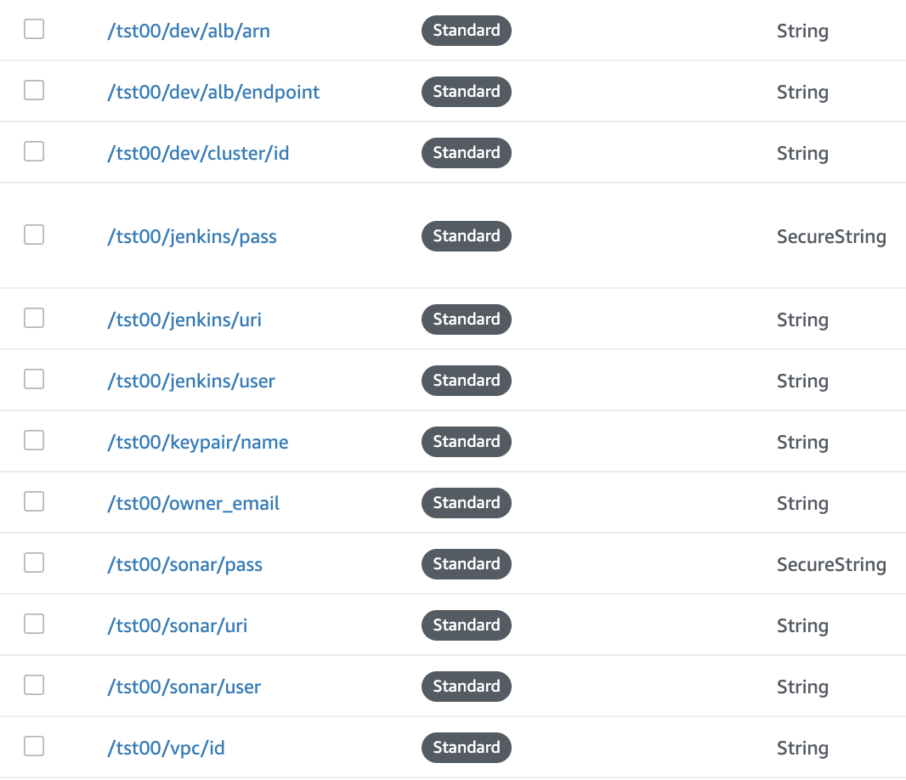

# Tech Challenge Platform - Glue

This is where tcp starts. This is where you can stand up a tech challenge platform - create, run and manage services in addition to pipelines and infrastructure for them. Whether you're starting and want to create a stack, or want to manage the services within your stack, you've come to the right place.

`tcp-glue` provides:

## App and Infrastructure Generate

When you finishing going through the tcp creation process, you'll end up with an app with a front-end, back-end, along with pipelines deploying it into cloud infrastructure.

Follow the process below to get started.

## Local app management

* **Clone all repositories** (in the .repos file). If new ones are added it can be run again: `./git-clone-all`. Get onboarding developers running fast.
* **Start up multiple services**: including core services at once, and specified individual services, all on the same network so they can talk
* **Update/pull all repos**

# Getting Started

## Stand up a Tech Challenge Platform

### Part 1: Prerequisites
There are some required configurations and setup that must be completed before running the platform.
1. GitHub Access
    1. Access to [GitHub](https://github.com/) is required
    1. Membership into the [ExcellaCo GitHub Organization](https://github.com/orgs/excellaco/people) is required.
       * Please request access via `help@excella.com`
    1. Membership in the `tcp-all` ExcellaCo GitHub Team is required.
        * Please request access via [Request to Join Button](https://github.com/orgs/excellaco/teams/tcp-all/members)

1. GitHub and MFA  
    If you have Multi-Factor Authentication (MFA) setup with your GitHub account, you must create a [Personal Access Token](https://help.github.com/en/articles/creating-a-personal-access-token-for-the-command-line), and use the generated token as your `password` for cloning over SSH.  
1. AWS Account Access and Credentials  
    Access to an AWS account is required.  Please contact `help@excella.com` to gain access to the ExcellaLabs account.  Regardless of the account, an `access_key` and `secret_key` are required for programatic access to the environment.   
1. AWS CLI install and Configuration  
    Once access to an AWS account is available, as well as an `access_key` and `secret_key`, the [AWS CLI Tool](https://docs.aws.amazon.com/cli/latest/userguide/cli-chap-install.html) must be installed, and configured by running `aws configure`  
1. Configure the AWS CLI when using MFA
    Special consideration is required when your AWS account is protected with a MFA device.  To configure the CLI, a `token` is required, which will provide temporary credentials.
    1. Obtain your [MFA ARN through the AWS Console](https://aws.amazon.com/premiumsupport/knowledge-center/authenticate-mfa-cli/).
    1. Run the following command:  
        `aws sts get-session-token --serial-number arn-of-the-mfa-device --token-code code-from-token --duration 129600 --output text`
        * Replace `arn-of-the-mfa-device` with your MFA device ARN.
        * Replace `code-from-token` with the code provided by your MFA device.
    1. Update your `~/.aws/credentials` file with the information from the previous command so it looks like the following:
        ```bash
        [default]
        aws_access_key_id = ASIARKL72BPXXXXXXXXXXXX
        aws_secret_access_key = LqDp3fFerc6NeDYe2wRXXXXXXXXXX
        aws_session_token = FQoGZXIvYXdzEM///////////XXXXXXXXXXX
        region = us-east-1
        output = json
        ```
    1. As an added measure run `export AWS_PROFILE=default`


### Part 2: Infrastructure

Follow the below steps to deploy the following into a clean account. This will be the foundation. Then you will set up Jenkins pipelines to deploy an app into ECS:

* AWS ECS cluster
* Jenkins AMI & EC2 instance
* Sonar instance

1.  Clone and cd into https://github.com/excellaco/tcp-glue
1. RUN: `./git-clone-all` [3]
    1. RUN: `./make-netrc && ./push-netrc`
    1. Fill out glue.auto.tfvars
    1. RUN: `./push-glue-auto-tfvars`
    1. RUN: `./update-json-file`
        * This updates the `jenkins/packer/jenkins.json` file with the correct email, region, and source AMI

1. cd `../jenkins`  [5]
    1. RUN: `docker build -t tcp-jenkins-ami:latest -f Docker/Dockerfile .`  
      * Estimated time for completion is: `00:02:30`  
    1. RUN: `docker run -it --rm -d --name tcp-jenkins-ami -v ~/.aws/credentials:/root/.aws/credentials tcp-jenkins-ami:latest`  
      * Estimated time for completion is: `00:20:00`  
      * Note the username and password for Jenkins, found near the beginning of the output  ( if you miss them, they will be available in the ssm_params, see below)
                * NOTE: You can allow this process to run in the background, and may continue on to the next steps to save time.

1. RUN: `cd tcp-ecs` [3b]
    1. RUN: `docker build -t tcp-ecs:latest -f Docker/Dockerfile .`  [3.3]
        * Ensure current directory is `tcp-ecs`  
        * Estimated time for completion is: `00:02:15`  
    1. RUN: `docker run -it --rm -d --name tcp-ecs -v ~/.aws/credentials:/root/.aws/credentials tcp-ecs:latest`  [3.4]
        * Ensure current directory is tcp-ecs  
        * Ensure ~/.aws/credentials default profile is set (MFA implications)  (to check: `aws sts get-caller-identity` )
        * Follow progress with `docker logs tcp-ecs -f`  
        * Estimated time for completion is: `00:12:30`  
    1. Get the SSH key:
        ```
        docker cp tcp-ecs:/tcp-ecs/keys/ssh .
        mv ssh/*.pub ssh/*.pem .
        ```
        This key will allow you to ssh through the bastion host to any of the instances you'll need to connect to.  Keep it somewhere secure but accessible.
1. cd `../terraform-aws-sonar-ecs-fargate`  [4]
    1. RUN: `docker build -t tcp-sonar:latest -f Docker/Dockerfile .`  
        * Ensure current directory is `terraform-aws-sonar-ecs-fargate`  
        * Estimated time for completion is: `00:01:30`  
    1. RUN: `docker run -it --rm -d --name tcp-sonar -v ~/.aws/credentials:/root/.aws/credentials tcp-sonar:latest`  
        * Follow progress with `docker logs tcp-sonar -f`  
        * Estimated time for completion is: `00:03:00`  
        * The "duplicate security group warning" can be ignored.  
1. cd `../terraform-aws-jenkins-stack`  
    1. RUN: `docker build -t tcp-jenkins-app:latest -f Docker/Dockerfile .`  
        * Estimated time for completion is: `00:02:00`  
    1. RUN: `docker run -it --rm -d --name tcp-jenkins-app -v ~/.aws/credentials:/root/.aws/credentials tcp-jenkins-app:latest`  
        * Estimated time for completion is: `00:05:00`  
        * Note the app_elb_dns output: this is the URI to use for the Jenkins instance
        * Wait until the EC2 instance is registered and available through the load balancer.  You can determine this by hitting the Jenkins instance in a browser, or by going to the AWS console and viewing the ELB (listed in the `app_elb_id` Terraform output).  It should take no more than a few minutes.

#### Misc Notes on Deployment
1. If you want to integrate Slack and Jenkins, please follow these [steps](https://medium.com/appgambit/integrating-jenkins-with-slack-notifications-4f14d1ce9c7a)  
1. Steps to setup multibranch pipeline jobs can be found [here](https://github.com/excellaco/terraform-aws-jenkins-stack/wiki/Multibranch-Pipeline-Setup)  

#### Accessing information
We've leverage SSM parameters to store all vital information, including URIs, and verious credentials.  If you have a question like "What's the Sonar URL?", or "What's the Jenkins Login/Password?", check the SSM parameters in the AWS account.

Parameters are stored in the form of `/"project_name"/"env"/"resource"/"attribute"`
  * The env path is only used when applicable
  * In the below references, the jenkins password for the tst00 project can be found at: `/tst00/jenkins/pass`
  * In the below references, the Development ECS Cluster ID can be found at: `/tst00/dev/cluser/id`




### Part 3: Application Deployment

### Part 4: Teardown

Do destroy the entire stack follow the below steps.  
1. cd `terraform-aws-jenkins-stack`  
1. RUN: `./bin/destroy_env`  
1. cd `../terraform-aws-sonar-ecs-fargate`  
1. RUN: `./bin/destroy_env`  
1. cd `../tcp-ecs`  
1. RUN: `./bin/destroy_env`    
1. Stop all running tcp containers  
1. Remove any tcp images  

# Using Glue for local development

Starting up multiple services across repositories that make up an app, in order to build locally, can be a pain. Glue can help you do that and related things more easily. Among other things, you can build and start the UI, API and a containerized Postgres database, and they will be able to talk to each other.

1. Since running multiple continers locally, add more available memory for Docker to handle many services running locally: `Under Docker > Preferences > Advanced` and set the following:
Memory: 4 Gb

1. Follow any specific setup steps for each conatiner (currently just the JKS setup in https://github.com/excellaco/tcp-java)

1. Build and run the UI, API and database containers locally by running:

    ```./run core```

Additional commands:

```
./run <SERVICE NAME or ALIAS>   # Run a single service

./run db                        # Start just a database

./git-pull-all                  # Pull against all of the managed repos

docker-compse down              # Stop and delete the containers
```

Note, all of the repos you want to work with should be subdirectories of glue like this:

    ```
    glue
    └── repo 1
    └── repo 2
    ...
    └── repo x
    ```
